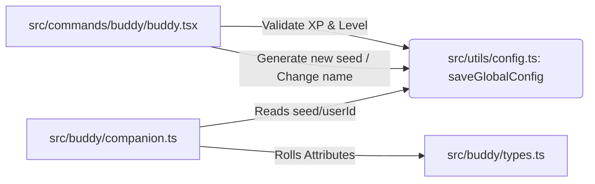

---

# 📝 Registro de Desenvolvimento — 2026-04-28

**Escopo:** Buddy Companion (Fase 4 - Customization Commands)
**Commits gerados:** 1
**Arquivos modificados:** 4

---

## 1. Visão Geral das Alterações

> A Fase 4 do projeto Buddy foi concluída implementando a capacidade do usuário gastar os XPs acumulados em personalizações de end-game. Foram criados os argumentos `/buddy rename` e `/buddy reroll`, estabelecendo lógica de controle para descontar XP de forma segura na interface e persistir características utilizando geração pseudo-aleatória determinística por seed.

---

## 2. Arquitetura Afetada

---

## 3. Mapa de Arquivos Modificados

| Arquivo                        | Tipo           | O que mudou                                                                             |
| ------------------------------ | -------------- | --------------------------------------------------------------------------------------- |
| `src/buddy/companion.ts`       | Utils          | Ajustado para buscar `seed` opcional do `StoredCompanion` no `getCompanion()`.          |
| `src/buddy/types.ts`           | Types          | Incluída propriedade `seed?: string` na interface `StoredCompanion`.                    |
| `src/commands/buddy/buddy.tsx` | CLI Command    | Implementados blocos para argumentos `rename` e `reroll`, com lógicas de dedução de XP. |
| `src/buddy/observer.ts`        | Event Observer | Lógica interna adaptada pra acompanhar o novo ciclo do `saveGlobalConfig`.              |

---

## 4. Detalhamento por Commit

### `feat(buddy): adiciona suporte a comandos de customização rename e reroll baseados em XP`

**Razão da alteração:**

> Usuários com nível máximo ou com XP estocada não tinham onde gastar. Customizações puramente cosméticas eram a meta para Phase 4 do roadmap.

**O que faz agora:**

> `/buddy rename` retira 2 XP, exige nível >=2 e salva o novo nome. `/buddy reroll` retira 10 XP e injeta uma semente aleatória `seed` na persistência do buddy.

**Decisões técnicas:**

> Para o reroll, em vez de modificar diretamente a espécie ou cor (o que seria chato de manter o tracking para dezenas de propriedades), injetamos uma nova `seed` na configuração global e deixamos o `rollWithSeed` do arquivo `companion.ts` processar a aleatoriedade naturalmente da próxima vez que o Buddy for instanciado.

**Arquivos envolvidos:**

- `src/buddy/types.ts` — Nova prop seed
- `src/buddy/companion.ts` — Lógica do fallback de Seed
- `src/commands/buddy/buddy.tsx` — Interpretador da CLI
- `src/buddy/observer.ts` — Ajustes complementares de build

---

## 5. ✅ O Que Está Funcionando

- O usuário recebe XP e sobe de nível.
- Ao usar o comando de renomeação ou reroll, o TypeScript reflete a subtração correta de XP.
- Seed aleatória injetada causa o reload visual correto das propriedades ao rodar comandos.
- Avisos impedem uso de `/buddy rename` antes do nível 2.

---

## 6. ❌ O Que Está Pendente

- `[ ]` Lembretes de Produtividade (Fase 3) — Ociosidade e Timer. (Será a próxima fase).

---

## 7. ⚠️ Dívida Técnica Identificada

- O projeto apresenta alguns testes do core (Auth Gemini e Perfis de OpenAI) em falha por falta de isolamento do ambiente local de chaves. Recomenda-se adicionar `.env.test` aos arquivos para os testes de Provider.
- O componente `Buddy` possui a tipagem extensa espalhada; a inserção de campos com `as import('../../buddy/types.js').Companion` nas linhas do JSX poderia ser agrupada para maior legibilidade no refactor.

---

## 8. Padrões Importantes a Lembrar

- As atualizações de estado do Buddy devem ser executadas com o callback dinâmico do `saveGlobalConfig(current => {...})` para impedir condições de corrida no progresso da XP.

---

## 9. Próximos Passos

1. Iniciar implementação dos Lembretes de Produtividade (tempo híbrido + ociosidade) como planejado no Roadmap.
2. Refatorar os testes em falha do repositório relacionados a variáveis locais se houver prioridade.

---

## 10. Validações Mapeadas

| Campo / Função   | Regra de validação                         | Status |
| ---------------- | ------------------------------------------ | ------ |
| `/buddy rename`  | Exige > 2 XP e Level > 2                   | ✅     |
| `/buddy reroll`  | Exige > 10 XP                              | ✅     |
| `getCompanion()` | Suporta fallback dinâmico (Seed -> UserId) | ✅     |

---
