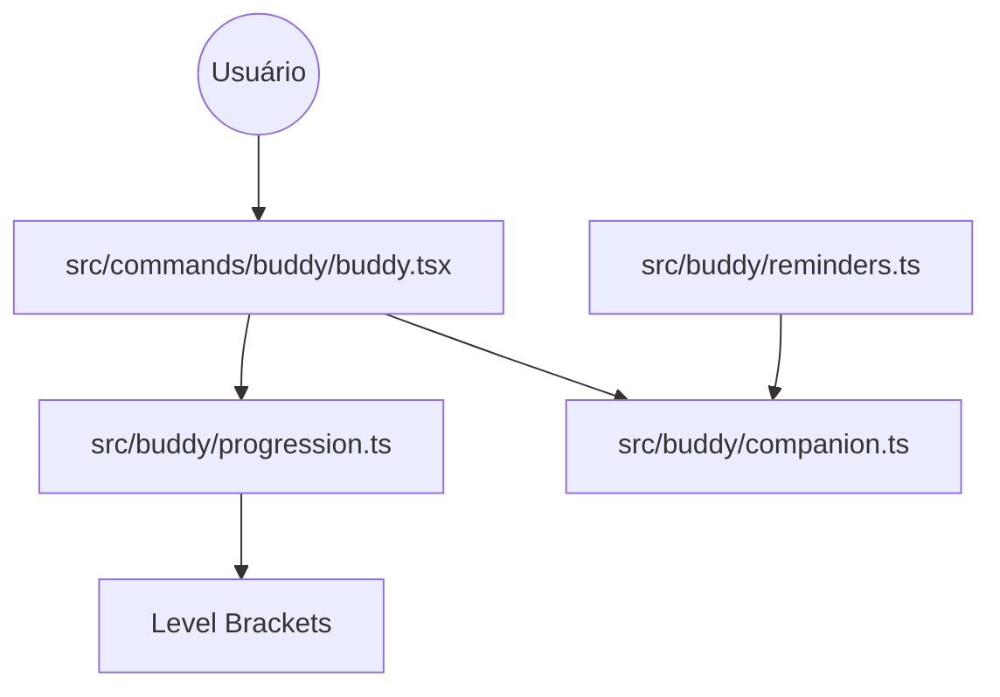

# 📝 Registro de Desenvolvimento — 2026-04-29

**Escopo:** Buddy System (Progression & Reminders)
**Commits gerados:** 4
**Arquivos modificados:** 16

---

## 1. Visão Geral das Alterações

Nesta sessão, foram implementados os sistemas fundamentais de progressão e engajamento do Buddy. Introduzimos uma lógica de XP que permite ao Buddy "subir de nível" conforme o uso do sistema, refletindo visualmente através de acessórios (chapéus) e status de humor. Além disso, foi adicionado um sistema de lembretes de produtividade para monitorar sessões longas de trabalho e períodos de inatividade, visando o bem-estar do desenvolvedor.

---

## 2. Arquitetura Afetada

Diagrama Mermaid mostrando os componentes modificados e suas relações:

---

## 3. Mapa de Arquivos Modificados

| Arquivo                        | Tipo      | O que mudou                                            |
| ------------------------------ | --------- | ------------------------------------------------------ |
| `src/buddy/progression.ts`     | Service   | Implementação da lógica de XP e níveis.                |
| `src/buddy/reminders.ts`       | Service   | Implementação de rastreador de atividade e lembretes.  |
| `src/commands/buddy/buddy.tsx` | Component | Integração com o sistema de níveis e limpeza de tipos. |
| `docs/superpowers/plans/...`   | Docs      | Planos de implementação detalhados.                    |
| `docs/superpowers/specs/...`   | Specs     | Especificações de design das novas features.           |
| `.trunk/...`                   | Config    | Arquivos de configuração do Trunk.                     |

---

## 4. Detalhamento por Commit

### `feat(buddy): implementa sistema de progressão e níveis para o Buddy`

**Razão da alteração:**
Necessidade de gamificar a experiência de uso e fornecer feedback visual sobre o progresso do projeto.

**O que faz agora:**
Calcula o nível do Buddy baseado em XP e retorna o status/acessório correspondente.

**Arquivos envolvidos:**

- `src/buddy/progression.ts` — Lógica de cálculo.
- `src/commands/buddy/buddy.tsx` — Consumo da lógica no comando `/buddy`.

### `feat(buddy): adiciona lembretes de produtividade`

**Razão da alteração:**
Melhorar o suporte ao desenvolvedor, incentivando pausas saudáveis e oferecendo ajuda em caso de bloqueios.

**O que faz agora:**
Monitora o tempo da sessão e o tempo desde a última atividade, disparando mensagens via Buddy.

**Arquivos envolvidos:**

- `src/buddy/reminders.ts` — Rastreador de tempo e inatividade.

### `docs(superpowers): adiciona especificações e planos de implementação`

**Razão da alteração:**
Documentar a intenção arquitetural e os passos de implementação.

**Arquivos envolvidos:**

- `docs/superpowers/plans/*`
- `docs/superpowers/specs/*`

### `chore: adiciona configuração do trunk`

**Razão da alteração:**
Padronização de linting e formatação no projeto.

---

## 5. ✅ O Que Está Funcionando

- [x] Cálculo de níveis baseado em XP.
- [x] Troca dinâmica de acessórios (chapéus) baseada no nível.
- [x] Monitoramento de tempo de sessão (1 hora).
- [x] Monitoramento de inatividade (15 minutos).
- [x] Mensagens aleatórias de engajamento.

---

## 6. ❌ O Que Está Pendente

- [ ] Persistência do XP no perfil do usuário — _XP atualmente é calculado em memória ou via config global._
- [ ] Interface visual para os lembretes — _Aguardando integração com o sistema de notificações UI._

---

## 7. ⚠️ Dívida Técnica Identificada

- Uso de `Date.now()` global em `reminders.ts` pode causar problemas em testes de unidade que dependem de tempo.
- Os Brackets de nível estão hardcoded, poderiam ser configuráveis.

---

## 8. Padrões Importantes a Lembrar

- Sempre utilizar `getLevelInfo` para obter o estado visual do Buddy.
- Lembretes devem ser não-intrusivos e amigáveis.

---

## 9. Próximos Passos

1. Integrar `checkProductivityReminders` no loop principal da aplicação.
2. Implementar ganho de XP real baseado em tarefas concluídas.
3. Criar testes de unidade para `progression.ts`.

---

## 10. Validações Mapeadas

| Campo / Função               | Regra de validação                        | Status |
| ---------------------------- | ----------------------------------------- | ------ |
| `getLevelInfo`               | Deve retornar level 1 para 0 XP           | ✅     |
| `checkProductivityReminders` | Não deve retornar lembrete antes do tempo | ✅     |
| `updateActivityTracker`      | Deve resetar o timer de inatividade       | ✅     |
