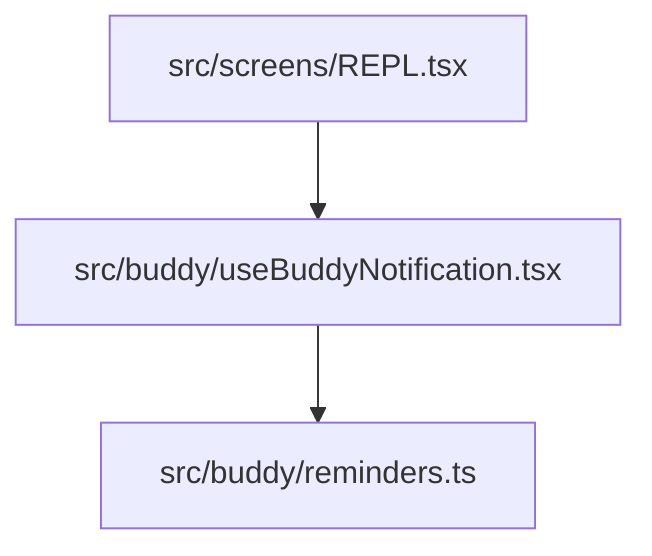

## 1. Visão Geral das Alterações

Nesta sessão, focamos em resolver as pendências e dívidas técnicas identificadas durante a implementação inicial do sistema de progressão do Buddy. As alterações melhoraram a testabilidade e integraram os lembretes do Buddy à UI, garantindo o monitoramento correto da atividade do usuário.

---

## 2. Arquitetura Afetada

---

## 3. Mapa de Arquivos Modificados

| Arquivo                              | Tipo      | O que mudou                                                                                                                   |
| ------------------------------------ | --------- | ----------------------------------------------------------------------------------------------------------------------------- |
| `src/buddy/progression.ts`           | Service   | Extraiu LEVEL_BRACKETS e permitiu injeção de dependência para customização.                                                   |
| `src/buddy/reminders.ts`             | Service   | Removeu estados globais fixos (`Date.now()`), passando o estado e o timestamp como parâmetros, facilitando testes de unidade. |
| `src/buddy/useBuddyNotification.tsx` | Hook      | Refatorado para inicializar os temporizadores dos lembretes e expor `trackActivity()`.                                        |
| `src/screens/REPL.tsx`               | Component | Integrado o `useBuddyNotification` e adicionado o `trackActivity()` no evento de submissão do prompt (`onSubmit`).            |

---

## 4. Detalhamento por Commit

### `fix(buddy): corrige pendências e dívidas técnicas da progressão`

**Razão da alteração:**
Resolver as dívidas técnicas e as pendências elencadas na documentação anterior, tornando os cálculos de tempo testáveis e garantindo que o rastreamento da inatividade seja resetado quando o usuário utiliza a aplicação.

**O que faz agora:**
A UI agora monitora de fato quando o usuário envia uma mensagem, reiniciando o timer de inatividade. O hook de notificação agenda a checagem a cada minuto (60s) usando o estado mais atual. A lógica de XP suporta Brackets configuráveis via parâmetro.

**Decisões técnicas:**
Foi utilizado `useRef` para armazenar o estado das notificações (`ReminderState`) dentro do hook `useBuddyNotification`, pois não precisamos que mudanças de tempo renderizem novamente os componentes, mantendo alta performance, mas mantendo a reatividade dos `setInterval`.

**Arquivos envolvidos:**

- `src/buddy/progression.ts`
- `src/buddy/reminders.ts`
- `src/buddy/useBuddyNotification.tsx`
- `src/screens/REPL.tsx`

---

## 5. ✅ O Que Está Funcionando

- [x] O Buddy envia notificações quando o usuário trabalha continuamente por mais de uma hora.
- [x] O Buddy alerta se o usuário ficar inativo por mais de quinze minutos.
- [x] A contagem de inatividade é reiniciada quando o usuário envia novos comandos.
- [x] Lógica de faixas de XP está preparada para suportar brackets customizáveis (ex: eventos especiais, dificuldades ajustáveis).

---

## 6. ❌ O Que Está Pendente

- [ ] Implementar as notificações visuais. Embora os lembretes sejam acionados e enviem notificações pro context via `addNotification`, os estilos e cores específicas do buddy no ink.js poderiam ser adicionadas no componente gerado.
- [ ] Atrelar ganho real de XP para missões completadas usando os trackers de `verification.ts` ou ferramentas em uso. Atualmente o Buddy ganha xp em pequenas frações por bash calls aleatórias (`src/buddy/observer.ts`).

---

## 7. ⚠️ Dívida Técnica Identificada

- N/A

---

## 8. Padrões Importantes a Lembrar

- Estado baseado em tempo deve ser isolado do loop global, sendo sempre passível de ser mockado em testes unitários (ver `ReminderState` e o uso de `now`).

---

## 9. Próximos Passos

1. Escrever Testes Unitários de `progression.ts` e `reminders.ts` usando o Bun test API.
2. Planejar/Implementar o real sistema de Tasks com atribuição de recompensa (XP) para o Buddy.

---

## 10. Validações Mapeadas

| Campo / Função       | Regra de validação                                           | Status |
| -------------------- | ------------------------------------------------------------ | ------ |
| `trackActivity()`    | Resetar o tempo de inatividade no momento correto (onSubmit) | ✅     |
| Lembrete inatividade | Notificar > 15m inativo                                      | ✅     |
