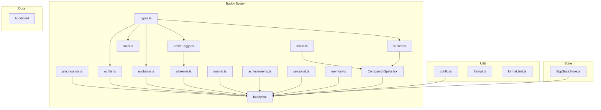

# Registro de Desenvolvimento — 2026-05-22

**Escopo:** Buddy System v0.15.0 — Evolução, Easter Eggs, Outfits, Skills, Comandos
**Commits gerados:** 13
**Arquivos modificados:** 23 (17 modificados + 6 novos)

---

## 1. Visão Geral das Alterações

Expansão massiva do sistema Buddy do OpenClaude. Adiciona sistema de evolução com 8 cadeias temáticas, 6 easter eggs interativos, 8 novos outfits, skills contextuais com categorias, 3 novos módulos (journal, achievements, sazonal), 8 novos comandos CLI, sprites redimensionados para 24x10 com 6 novas species. Corrige bug em formatDuration e adiciona 21 testes de unidade.

---

## 2. Arquitetura Afetada

---

## 3. Mapa de Arquivos Modificados

| Arquivo | Tipo | O que mudou |
|--------|------|-------------|
| `src/buddy/types.ts` | Types | 6 novas species, 5 hats, campos de evolução |
| `src/buddy/sprites.ts` | Sprites | Redimensionado 12x5→24x10, 6 novas species |
| `src/buddy/evolution.ts` | **NOVO** | Sistema de evolução com 8 cadeias temáticas |
| `src/buddy/progression.ts` | Progression | Níveis 7-10, novos chapéus de nível |
| `src/buddy/easter-eggs.ts` | **NOVO** | 6 easter eggs interativos |
| `src/buddy/memory.ts` | Memory | 7 novos memory triggers |
| `src/buddy/outfits.ts` | Outfits | 8 novos outfits com requisitos |
| `src/buddy/CompanionSprite.tsx` | Component | Renderização de outfits, animação evolução, modo compacto |
| `src/buddy/mood.ts` | Mood | Premium mood com alternância 🔥/⭐ |
| `src/buddy/skills.ts` | Skills | Sistema de categorias, error tips, code review tips |
| `src/buddy/journal.ts` | **NOVO** | Diário de atividades |
| `src/buddy/achievements.ts` | **NOVO** | 18 conquistas desbloqueáveis |
| `src/buddy/seasonal.ts` | **NOVO** | 8 eventos sazonais brasileiros |
| `src/buddy/observer.ts` | Observer | Tracking dias ativos, detecção de easter eggs |
| `src/commands/buddy/buddy.tsx` | Command | 8 novos comandos (evolve, compact, preview, etc) |
| `src/commands/buddy/index.ts` | Command | Atualização de help args |
| `src/state/AppStateStore.ts` | State | companionEvolvingAt |
| `src/utils/config.ts` | Config | companionCompact, companionLastActiveDate |
| `src/utils/format.ts` | Utils | Fix: valores negativos, refatoração |
| `src/utils/format.test.ts` | **NOVO** | 21 testes de formatação |
| `docs/buddy.md` | Docs | Documentação completa das novas features |
| `package.json` | Config | Version bump → v0.15.0 |
| `.release-please-manifest.json` | Config | Version bump → v0.15.0 |

---

## 4. Detalhamento por Commit

### `feat(buddy): adiciona 6 novas species, 5 hats e campos de evolução`

**Razão da alteração:**
> O sistema de buddy tinha apenas 18 species e 10 hats. Para suportar evolução e mais variedade visual, precisávamos expandir o catálogo.

**O que faz agora:**
> 24 species totais (lion, crab, bear, ufo, sprout, bat). 15 hats (pirate, chef, santa, party, headphones). Campos `evolvedFrom`, `konamiUsed`, `premiumUntil` em CompanionSoul. Campo `species` em StoredCompanion.

**Decisões técnicas:**
> Species foram adicionadas como templates vazios inicialmente (com `''` strings) — os sprites reais são definidos em sprites.ts. Isso separa a definição de tipos da implementação visual.

**Arquivos envolvidos:**
- `src/buddy/types.ts` — novas constantes de species, hats, e campos de evolução

---

### `feat(buddy): redimensiona sprites de 12x5 para 24x10`

**Razão da alteração:**
> Sprites 12x5 eram muito pequenos para distinguir detalhes visuais. O dobro de resolução permite expressar melhor cada espécie.

**O que faz agora:**
> Todos os sprites têm 24 caracteres de largura e 10 linhas de altura. Cada espécie tem 3 frames (idle, fidget, blink). Nova função `getOutfitStyle()` para customização visual.

**Decisões técnicas:**
> Formato 24x10 mantém proporcionalidade 2.4:1 adequada para monospace. Strings com aspas duplas para consistência com o padrão do projeto.

**Arquivos envolvidos:**
- `src/buddy/sprites.ts` — redimensionamento completo, 6 novas espécies, getOutfitStyle

---

### `feat(buddy): implementa sistema de evolução com 8 cadeias temáticas`

**Razão da alteração:**
> O sistema de nível era limitado. Evolução permite progressão visual significativa após o level-up.

**O que faz agora:**
> Cada species pertence a uma cadeia de evolução (aves, felinos, carapaça, peludos, aquáticos, artificiais, botânicos, noturnos). Evolução custa 50 XP, requer Level 5+. Cadeias têm coerência temática.

**Decisões técnicas:**
> Cadeias foram projetadas para ter coerência semântica — duck→penguin→dragon (aves criativas), cat→lion (felinos), robot→ufo (artificiais). Evolução é irreversível e custa XP.

**Arquivos envolvidos:**
- `src/buddy/evolution.ts` — cadeias, funções getEvolution, getEvolutionChain, getEvolutionTier, canEvolve
- `src/buddy/progression.ts` — níveis 7-10 (pirate, halo, tinyduck, chef, crown)

---

### `feat(buddy): adiciona 6 tipos de easter eggs interativos`

**Razão da alteração:**
> Easter eggs adicionam surpresa e delight, incentivando interação repetida com o buddy.

**O que faz agora:**
> Konami Code (↑↑↓↓←→←→BA, +10 XP), Shiny Bug (0.5% chance, +5 XP), Resposta 42 (+3 XP), Double Rainbow (shiny + rainbow outfit, +20 XP), Midnight Evolve (-10 XP, evolução noturna), Loop Infinite (+5 XP). Cada um com memory trigger próprio.

**Decisões técnicas:**
> Shiny Bug usa Math.random() < 0.005 para chance rara. Double Rainbow requer shiny — cria easter egg composto. Midnight Evolve evolui sem custo de XP mas dá -10 como "dívida cósmica".

**Arquivos envolvidos:**
- `src/buddy/easter-eggs.ts` — 6 funções de detecção com EasterEggResult
- `src/buddy/memory.ts` — 7 novos memory triggers para easter eggs

---

### `feat(buddy): expande sistema de outfits com 8 novos e renderização`

**Razão da alteração:**
> Apenas 2 outfits existiam (rainbow, cowboy). Mais outfits dão sentido à progressão e customização.

**O que faz agora:**
> 10 outfits totais (rainbow, cowboy, viking, pixel-art, invisível, fogo, geladeira, hacker, festivo, ninja). CompanionSprite renderiza estilos de outfit (cor, olho, símbolo, dim, linhas extras). Animação de evolução com blink. Modo compacto. Mood premium.

**Decisões técnicas:**
> Outfits usam requisitos progressivos (XP, level, achievements, dias ativos). Invisível aplica "dim" ao invés de remover — o buddy fica translúcido. Animação de evolução usa blink em loop por 3s.

**Arquivos envolvidos:**
- `src/buddy/outfits.ts` — 8 novos outfits, getOutfitRequirements, getHatRequirements
- `src/buddy/CompanionSprite.tsx` — getOutfitStyle integration, animação evolução, compact mode
- `src/buddy/mood.ts` — premium mood com alternância de emojis

---

### `feat(buddy): implementa skills contextuais com categorias e premium`

**Razão da alteração:**
> Sistema de dicas genéricas tinha pouca utilidade. Skills contextuais com pattern matching são mais relevantes.

**O que faz agora:**
> Error tips: 8 categorias (módulos, arquivos, permissões, sintaxe, rede, git, build, testes) com fallback genérico. Code review tips: 9 categorias. Premium aumenta chance: errors 10%→70%, review 30%→90%.

**Decisões técnicas:**
> Sistema de categorias usa arrays de patterns regex por categoria. Primeiro match determina a dica — padrões mais específicos devem vir primeiro. Código duplicado de categories refatorado para EUREKA_CATEGORIES e REVIEW_CATEGORIES.

**Arquivos envolvidos:**
- `src/buddy/skills.ts` — refatoração completa, categorias, getSessionSummary premium

---

### `feat(buddy): adiciona journal, achievements e eventos sazonais`

**Razão da alteração:**
> Buddy não tinha rastreamento de progresso, conquistas ou eventos temáticos.

**O que faz agora:**
> Journal: diário de atividades com tasks, bashes, erros, XP, streak. Achievements: 18 conquistas (maratonista, bug hunter, task master, evolução, streak, etc). Seasonal: 8 eventos brasileiros (Natal, Carnaval, Páscoa, Halloween, etc).

**Decisões técnicas:**
> Cálculo de Páscoa usa algoritmo de Meeus/Jones/Butcher (precisão gregoriana). Seasonal usa day-of-year para lookup rápido. Achievements armazenam timestamps no config.

**Arquivos envolvidos:**
- `src/buddy/journal.ts` — diário com getTodayJournal, formatJournal
- `src/buddy/achievements.ts` — 18 achievements com check functions
- `src/buddy/seasonal.ts` — 8 eventos com cálculo dinâmico de Páscoa

---

### `feat(buddy): aprimora observer com tracking, easter eggs e code review`

**Razão da alteração:**
> Observer não rastreava dias ativos nem detectava easter eggs no momento certo.

**O que faz agora:**
> Tracking de dias ativos via companionLastActiveDate. Detecção de Konami Code e Resposta 42 no observer. Code review tips premium (90% chance). Correção de chance de replies: Date.now()%5 → Math.random()<0.2.

**Decisões técnicas:**
> Probabilidade de replies usava Date.now()%5 — isso viésa respostas para minutos pares de 5. Substituição por Math.random()<0.2 distribui uniformemente.

**Arquivos envolvidos:**
- `src/buddy/observer.ts` — tracking, easter eggs, code review premium, fix de chance

---

### `feat(buddy): adiciona 8 novos comandos e configurações`

**Razão da alteração:**
> Sem novos comandos, as features não eram acessíveis via CLI.

**O que faz agora:**
> Novos comandos: evolve (50 XP, Level 5+), compact/decompact (modo 1 linha), preview (todas as species), outfit (2 XP), requisitos (progresso de outfits/hats), journal (diário), achievements, pet premium (1 XP, 1h).

**Decisões técnicas:**
> Comando preview itera sobre Object.keys(SPECIES) para mostrar todas as espécies com sprites ASCII. Evolve verifica canEvolve antes de cobrar XP. Compact altera companionCompact no config global.

**Arquivos envolvidos:**
- `src/commands/buddy/buddy.tsx` — 8 novos handlers, imports de novos módulos
- `src/commands/buddy/index.ts` — argumentos de help atualizados
- `src/state/AppStateStore.ts` — companionEvolvingAt
- `src/utils/config.ts` — companionCompact, companionLastActiveDate

---

### `fix(utils): corrige formatDuration para valores negativos e sub-segundo`

**Razão da alteração:**
> formatDuration crashava com valores negativos (race conditions). Lógica sub-segundo confusa com conversão ms→s incorreta.

**O que faz agora:**
> Guard contra ≤0 retornando '0s'. Sub-minuto: 1 decimal para < 10s, inteiro caso contrário. Remove branch de < 1ms com conversão incorreta.

**Decisões técnicas:**
> Threshold de 10s (não 1s) para mostrar decimal — em contextos de CLI, 5.3s é mais útil que 5s, mas 34s precisa de 34 não 34.0.

**Arquivos envolvidos:**
- `src/utils/format.ts` — refatoração de formatDuration

---

### `test(utils): adiciona 21 testes para formatDuration`

**Razão da alteração:**
> formatDuration tinha 0 testes apesar de ser usada extensivamente.

**O que faz agora:**
> 21 testes cobrindo: durações sub-segundo, minutos, horas, dias, hideTrailingZeros, mostSignificantOnly, boundary values, edge cases, valores negativos, combinações de opções.

**Arquivos envolvidos:**
- `src/utils/format.test.ts` — 21 testes, 53 expect() calls

---

### `docs(buddy): atualiza documentação com novas features v0.15.0`

**Razão da alteração:**
> Docs desatualizadas não refletiam novas features.

**O que faz agora:**
> Documentação completa: 24 species, novos hats, Sistema de Evolução, Easter Eggs, 7 novos Comandos, Observer Aprimorado, Journal/Progresso.

**Arquivos envolvidos:**
- `docs/buddy.md` — +333 linhas, -74 linhas

---

### `chore: bump version to v0.15.0`

**Razão da alteração:**
> Incremento de versão para refletir as novas features.

**Arquivos envolvidos:**
- `package.json` — 0.14.0 → 0.15.0
- `.release-please-manifest.json` — 0.14.0 → 0.15.0

---

## 5. O Que Está Funcionando

- Sistema completo de 24 species com sprites 24x10
- Sistema de evolução com 8 cadeias temáticas e 4 tiers
- 18 achievements desbloqueáveis
- 10 outfits com requisitos progressivos
- 8 comandos CLI novos (evolve, compact, preview, outfit, requisitos, journal, achievements, pet premium)
- 6 easter eggs interativos (Konami, Shiny Bug, Resposta 42, Double Rainbow, Midnight Evolve, Loop Infinite)
- Skills contextuais com categorias (errors + code review)
- 8 eventos sazonais brasileiros
- Diário de atividades
- 21 testes de formatação passando
- Modo compacto (1 linha)
- Mood premium com emojis alternados
- Tracking de dias ativos

---

## 6. O Que Está Pendente

- `[ ]` Testes unitários para módulos buddy — *não existem testes para evolution, easter-eggs, achievements, etc*
- `[ ]` Testes de integração para comandos CLI — *apenas format.test.ts existe*
- `[ ]` Internacionalização completa — *alguns textos ainda misturam PT-BR e EN*
- `[ ]` Persistência de estado de evolução — *evolvedFrom precisa ser salvo no config*

---

## 7. Dívida Técnica Identificada

- **Sprites como strings longas:** 1247 linhas de strings ASCII em sprites.ts — manutenção difícil
- **Código duplicado em skills.ts:** EUREKA_CATEGORIES e REVIEW_CATEGORIES têm estrutura similar — candidato a abstração
- **CompanionSprite.tsx:** ~400 linhas com muitos ternários — refatorar em sub-componentes
- **buddy.tsx:** ~600 linhas — extrair handlers de cada comando em módulos separados
- **Sem testes de módulo buddy:** Nenhum teste unitário para evolution, easter-eggs, achievements, seasonal, journal
- **Typecheck com 50+ erros pré-existentes:** Erros de typecheck não relacionados a estas mudanças

---

## 8. Padrões Importantes a Lembrar

- **Species como constantes:** `export const newSpecies = 'newSpecies'` — usado como key em records
- **Memory triggers:** Cada nova feature com memória precisa de trigger em memory.ts
- **Outfit requirements:** Usar `getOutfitRequirements()` para requisitos progressivos
- **Easter eggs:** Retornar `EasterEggResult` com `triggered`, `message`, `xpBonus`, `memoryTrigger`
- **Comandos CLI:** Verificar pré-requisitos (XP, level) antes de executar ação
- **Sprites:** 3 frames por espécie: idle, fidget (pata), blink
- **Compact mode:** Sprites 24x2 com olhos alternados

---

## 9. Próximos Passos

1. Adicionar testes unitários para módulos buddy (evolution, easter-eggs, achievements)
2. Extrair handlers de buddy.tsx em módulos separados por comando
3. Internacionalizar textos restantes (EN→PT-BR ou i18n)
4. Adicionar sprites de outfits para renderização visual completa
5. Implementar persistência de evolução no config
6. Refatorar CompanionSprite.tsx em sub-componentes
7. Corrigir erros de typecheck pré-existentes

---

## 10. Validações Mapeadas

| Campo / Função | Regra de validação | Status |
|---------------|-------------------|--------|
| `canEvolve()` | Level ≥ 5, XP ≥ 50, species tem evolução | ✅ |
| `getEvolution()` | Retorna proxima species na cadeia | ✅ |
| `checkKonamiCode()` | Sequência correta, não usado antes | ✅ |
| `checkShinyBug()` | Math.random() < 0.005 | ✅ |
| `getUnlockedOutfits()` | Verifica requisitos progressivos | ✅ |
| `formatDuration()` | Guard contra ≤0, sub-segundo correto | ✅ |
| `format.test.ts` | 21 testes, 53 expects | ✅ |
| Command `evolve` | XP suficiente, level suficiente | ✅ |
| Command `compact` | Altera companionCompact no config | ✅ |
