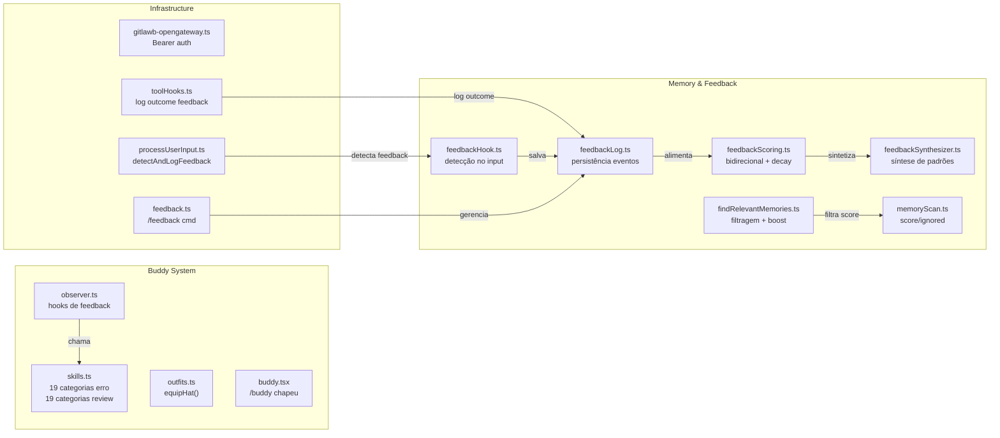

# 📝 Registro de Desenvolvimento — 2026-05-25

**Escopo:** Buddy skills, feedback learning, chapéu manual, gateway auth
**Commits gerados:** 7
**Arquivos modificados:** 21

---

## 1. Visão Geral das Alterações

Sessão focada em três frentes principais: (1) expansão massiva do sistema de skills do buddy, quase dobrando as categorias de diagnóstico de erros e code review; (2) implementação do sistema de feedback learning que detecta, registra e sintetiza feedbacks do usuário automaticamente; (3) comando `/buddy chapeu` para troca manual de chapéus. Correção menor no gateway de autenticação do Gitlawb OpenGateway.

---

## 2. Arquitetura Afetada

---

## 3. Mapa de Arquivos Modificados

| Arquivo | Tipo | O que mudou |
|--------|------|-------------|
| `src/buddy/outfits.ts` | Module | Nova função `equipHat()` para equipar chapéus manualmente |
| `src/buddy/outfits.test.ts` | Test (novo) | 15 testes unitários para equipHat e getHatRequirements |
| `src/buddy/skills.ts` | Module | Expansão de 8→19 categorias de erro, 10→19 categorias de review |
| `src/buddy/observer.ts` | Module | Atualização de comments de chance (10%/70% → 85%/98%) |
| `src/commands/buddy/buddy.tsx` | Command | Handler `chapeu`/`chapéu` com lista e equipagem |
| `src/commands/buddy/index.ts` | Command | argumentHint atualizado |
| `src/hooks/feedbackHook.ts` | Hook (novo) | Detecção automática de feedback no input do usuário |
| `src/memdir/feedbackLog.ts` | Module (novo) | Persistência de eventos de feedback em memória |
| `src/memdir/feedbackScoring.ts` | Module (novo) | Scoring bidirecional com decay temporal |
| `src/memdir/feedbackSynthesizer.ts` | Module (novo) | Síntese de padrões recorrentes em memória |
| `src/memdir/feedback.test.ts` | Test (novo) | Testes unitários do sistema de feedback |
| `src/memdir/findRelevantMemories.ts` | Module | Filtragem por score >= 20, boost para score >= 80 |
| `src/memdir/memoryScan.ts` | Module | Parse de score, confirmations e ignored do frontmatter |
| `src/commands/feedback/feedback.ts` | Command (novo) | Comando /feedback local (substitui JSX) |
| `src/commands/feedback/feedback.tsx` | Command (removido) | Migrou para feedback.ts |
| `src/commands/feedback/index.ts` | Command | Migrado de JSX para local, isEnabled: true |
| `src/integrations/gateways/gitlawb-opengateway.ts` | Gateway | Auth corrigida: api-key raw → Bearer token |
| `src/services/tools/toolHooks.ts` | Module | Log automático de outcome (sucesso/falha) no feedback |
| `src/utils/processUserInput/processUserInput.ts` | Module | Integração do feedbackHook no pipeline de input |
| `docs/buddy.md` | Docs | Tabelas de 19 categorias de erro e review com regex |
| `docs/superpowers/specs/...` | Spec (novo) | Spec de design do novo sistema de skills |
| `package.json` | Config | Bump versão 0.15.0 → 0.16.0 |

---

## 4. Detalhamento por Commit

### `feat(buddy): adiciona comando /buddy chapeu para equipar chapéus manualmente`

**Razão da alteração:**
> Os chapéus do buddy só mudavam automaticamente ao subir de nível. O usuário queria poder trocar livremente entre os já desbloqueados.

**O que faz agora:**
> Comando `/buddy chapeu` mostra lista de todos os chapéus com status (🔒/🔓) e equipado (✅). `/buddy chapeu <nome>` equipa o chapéu se desbloqueado. Aceita `chapeu` e `chapéu` (com acento). Sem custo de XP.

**Decisões técnicas:**
> Função `equipHat()` reutiliza `getHatRequirements()` existente para validação. Sem mock de `progression.js` nos testes (função pura, deadlock com `mock.module` circular). Testes mockam apenas `config.js`.

**Arquivos envolvidos:**
- `src/buddy/outfits.ts` — nova `equipHat()` exportada
- `src/buddy/outfits.test.ts` — 15 testes (9 equipHat + 6 getHatRequirements)
- `src/commands/buddy/buddy.tsx` — handler chapeu + import equipHat
- `src/commands/buddy/index.ts` — argumentHint atualizado

---

### `feat(buddy): expande categorias de skills de erro e code review`

**Razão da alteração:**
> As 8 categorias de diagnóstico de erro e 10 de code review não cobriam cenários comuns como banco de dados, CI/CD, Docker, CORS, SSL, etc. O buddy tinha chances muito baixas de dar dicas (10% erro, 30% review).

**O que faz agora:**
> 19 categorias de erro (adiciona banco de dados, CI/CD, Docker, CORS, SSL, memória, disco, env vars, linting, portas em uso, git repos). 19 categorias de review (adiciona banco de dados, frontend/dev, lint, git pull/fetch, Python, Rust, Go, GitHub CLI). Chances: erro 85%/98%, review 75%/98%.

**Decisões técnicas:**
> Aumento de chances para tornar o buddy mais útil no dia a dia. Padrões regex refinados (ex: `/\bdel\b/i` em vez de `/del\b/i` para evitar falsos positivos). Separação de `git` genérico em categorias específicas (merge, detached, rebase).

**Arquivos envolvidos:**
- `src/buddy/skills.ts` — ERROR_TIP_CATEGORIES e CODE_REVIEW_CATEGORIES expandidos
- `src/buddy/observer.ts` — comments atualizados com novas chances

---

### `feat(memdir): implementa sistema de feedback learning`

**Razão da alteração:**
> O agente não aprendia com feedbacks do usuário. Feedbacks eram perdidos entre sessões. Nenhum mecanismo de scoring ou síntese de padrões.

**O que faz agora:**
> Sistema híbrido que: (1) detecta feedback automaticamente no input do usuário via `feedbackHook.ts`; (2) loga outcomes de ferramentas (sucesso/falha) via `toolHooks.ts`; (3) persiste em memória via `feedbackLog.ts`; (4) faz scoring bidirecional com decay temporal via `feedbackScoring.ts`; (5) sintetiza padrões recorrentes via `feedbackSynthesizer.ts`. Comando `/feedback` para gerenciar.

**Decisões técnicas:**
> Migrado comando feedback de JSX (React) para local (não-interativo) para suportar `supportsNonInteractive`. Hooks usam `void ... .catch(() => {})` para não bloquear o fluxo principal. Scoring usa decay exponencial para feedbacks antigos perderem relevância.

**Arquivos envolvidos:**
- `src/hooks/feedbackHook.ts` — detecção no input
- `src/memdir/feedbackLog.ts` — persistência
- `src/memdir/feedbackScoring.ts` — scoring
- `src/memdir/feedbackSynthesizer.ts` — síntese
- `src/memdir/feedback.test.ts` — testes
- `src/commands/feedback/feedback.ts` — comando /feedback
- `src/commands/feedback/feedback.tsx` — removido (migrado)
- `src/services/tools/toolHooks.ts` — log de outcome
- `src/utils/processUserInput/processUserInput.ts` — integração

---

### `fix(gateway): corrige auth do Gitlawb OpenGateway para Bearer token`

**Razão da alteração:**
> O gateway estava usando `api-key` header com esquema `raw` em vez de `Authorization` com `Bearer`, causando falhas de autenticação.

**O que faz agora:**
> Usa `Authorization: Bearer <token>` padrão e habilita `supportsAuthHeaders: true`.

**Arquivos envolvidos:**
- `src/integrations/gateways/gitlawb-opengateway.ts` — 3 linhas alteradas

---

### `feat(memdir): scoring e filtragem de memórias por relevância`

**Razão da alteração:**
> Memórias irrelevantes ou desatualizadas eram carregadas igualmente, desperdiçando contexto.

**O que faz agora:**
> Filtra memórias com score < 20 e ignoradas. Memórias críticas (score >= 80) são sempre carregadas automaticamente. Frontmatter suporta `score`, `confirmations` e `ignored`.

**Arquivos envolvidos:**
- `src/memdir/memoryScan.ts` — parse de novos campos
- `src/memdir/findRelevantMemories.ts` — filtragem + boost

---

### `docs(buddy): atualiza documentação com categorias expandidas de skills`

**Razão da alteração:**
> Docs desatualizadas com apenas 8 categorias de erro e 10 de review.

**O que faz agora:**
> Tabelas completas com 19 categorias cada, incluindo regex patterns e exemplos de dicas.

**Arquivos envolvidos:**
- `docs/buddy.md` — seções de Error Tips e Code Review expandidas

---

### `chore: bump version to v0.16.0`

**Razão da alteração:**
> Novas features significativas justificam bump minor.

**Arquivos envolvidos:**
- `package.json` — versão 0.15.0 → 0.16.0

---

## 5. ✅ O Que Está Funcionando

- [x] Comando `/buddy chapeu` — lista e equipa chapéus desbloqueados
- [x] Comando `/buddy chapeu <nome>` — equipa chapéu específico
- [x] 15 testes passando para equipHat/getHatRequirements
- [x] 19 categorias de diagnóstico de erros (85%/98% chance)
- [x] 19 categorias de code review (75%/98% chance)
- [x] Sistema de feedback learning completo (detect + log + score + synthesize)
- [x] Comando `/feedback` funcional (confirm, list, review, ignore, synthesize, clear, reset)
- [x] Filtragem de memórias por score (>= 20 para inclusão, >= 80 para boost)
- [x] Gateway Gitlawb com Bearer auth corrigida

---

## 6. ❌ O Que Está Pendente

- [ ] Testes unitários para o sistema de feedback learning (feedbackHook, feedbackScoring, feedbackSynthesizer)
- [ ] Testes para as novas categorias de skills (match de regex patterns)
- [ ] Integração do scoring de memória com o feedbackSynthesizer
- [ ] UI web para visualização de feedbacks aprendidos

---

## 7. ⚠️ Dívida Técnica Identificada

- `feedback.ts` novo (217 linhas) mistura lógica de comando com renderização de output — poderia extrair helpers
- `feedbackScoring.ts` (26 linhas) é muito pequeno — considerar merge com `feedbackLog.ts`
- Algumas regex de categorias de skills são muito genéricas (ex: `/git/i` em "git repos") e podem ter falsos positivos
- `toolHooks.ts` agora tem 2 blocos quase idênticos de `logFeedbackEvent` (sucesso e falha) — candidato a extração

---

## 8. Padrões Importantes a Lembrar

- **Mock circular no bun:test**: Não usar `mock.module('./X', async () => import('./X'))` — causa deadlock. Para funções puras, deixar o import real.
- **Feedback hooks**: Usar `void fn().catch(() => {})` para não bloquear o fluxo principal do tool/processUserInput.
- **Chapéu vs Outfit**: Chapéu é cosmético gratuito (troca livre). Outfit é skin com custo de XP.
- **Scoring de memória**: Score < 20 filtrado, >= 80 boosted. Ignored = true remove da seleção.

---

## 9. Próximos Passos

1. Adicionar testes para feedbackHook, feedbackScoring e feedbackSynthesizer
2. Testes de regex matching para as 38 categorias de skills
3. Integrar feedbackSynthesizer com o loop de síntese automática (período/limiar)
4. Considerar persistência do feedback learning em arquivo (além de memória)
5. UI web para dashboard de feedbacks aprendidos

---

## 10. Validações Mapeadas

| Campo / Função | Regra de validação | Status |
|---------------|-------------------|--------|
| `equipHat(hat)` | Hat deve estar desbloqueado via nível ou conquista | ✅ |
| `equipHat(hat)` | Companion deve existir no config | ✅ |
| `getHatRequirements()` | Retorna 12 chapéus (9 nível + 3 conquista) | ✅ |
| `getErrorTip()` | 85% normal, 98% premium | ✅ |
| `getCodeReviewTip()` | 75% normal, 98% premium | ✅ |
| `feedbackHook` | Detecta padrões de feedback no input | ✅ |
| `feedbackLog` | Persiste eventos em memória | ✅ |
| `memoryScan` | Parseia score/confirmations/ignored | ✅ |
| `findRelevantMemories` | Filtra score < 20, boost >= 80 | ✅ |
| `gitlawb-opengateway` | Bearer token auth | ✅ |
