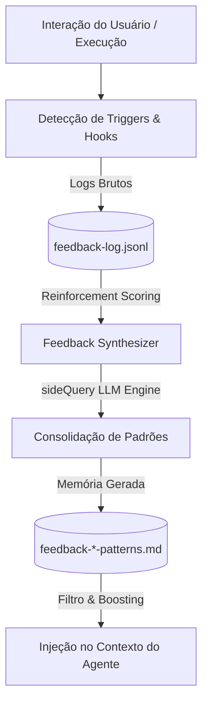

# 🧠 Sistema de Aprendizado de Feedback (Feedback Learning System)

O **Sistema de Aprendizado de Feedback** do OpenClaude é uma arquitetura de aprendizado contínuo projetada para capacitar o agente de IA a aprender com seus próprios erros, correções do usuário, rejeições de comandos e falhas em ferramentas de maneira persistente e contextualizada por projeto.

Funcionando de forma análoga ao **aprendizado por reforço**, o sistema rastreia o histórico de interações da sessão em arquivos de log JSONL (`feedback-log.jsonl`) e consolida esses aprendizados em memórias de feedback estruturadas na pasta de memória local do projeto.

---

## 🏗️ Arquitetura do Sistema

O sistema é estruturado em três camadas integradas:



### 1. Camada de Captura e Registro (Hooks & Triggers)

Esta camada monitora passivamente a sessão para registrar eventos sem bloquear a experiência do REPL.

- **Detecção de Undo/Revert (`src/hooks/feedbackHook.ts`)**:
  - Monitora comandos de terminal como `git checkout`, `git restore` ou `git reset` focados em arquivos modificados na turn anterior.
  - Detecta intenções explícitas de desfazer alterações no prompt do usuário (ex: _"desfaça isso"_, _"volte a versão anterior"_).
- **Detecção de Correções do Usuário (`src/hooks/feedbackHook.ts`)**:
  - Analisa o prompt do usuário em busca de palavras-chave corretivas (ex: _"não use"_, _"corrija"_, _"você errou"_, _"wrong"_, _"instead"_).
  - Extrai caminhos de arquivos modificados recentemente e registra o par de contexto `(Original, Correção)`.
- **Resultados de Ferramentas (`src/services/tools/toolHooks.ts`)**:
  - Registra estatísticas de sucesso e falha (erros retornados por compiladores, comandos inválidos, etc.) para modular a pontuação dos arquivos envolvidos.

---

### 2. Camada de Pontuação por Reforço (Reinforcement Scoring)

Cada tema de memória gerado possui metadados em formato YAML frontmatter, incluindo um **Score de Relevância (0 a 100)** e o número de **Confirmações**.

> [!TIP]
> **Tabela de Ajustes de Pontuação (Reinforcement Deltas):**
>
> - **Sucesso Consistente (`+5`)**: Execução de sessões sem undos ou correções no tema.
> - **Consolidação pelo Sintetizador (`+3`)**: Re-sintetização inteligente e fusão de dados.
> - **Confirmação do Usuário (`+10` / `+2 confir.`)**: Execução manual do comando `/feedback confirm`.
> - **Correção do Usuário (`-5`)**: Usuário corrigiu um padrão do tema explicitamente.
> - **Falha / Desfazimento (`-10`)**: Ocorrência de erro crítico ou comando de undo no tema.

---

### 3. Camada de Retenção e Injeção Dinâmica

Os arquivos de memória gerados são lidos em tempo real antes de cada prompt do agente:

- **Omissão de Regras Fracas/Ignoradas**:
  - Qualquer arquivo de memória com `score < 20` (obsoleto/stale) ou com a tag `ignored: true` no frontmatter é **omitido do prompt do sistema**, evitando consumo inútil de tokens.
- **Boosting de Regras Críticas**:
  - Memórias com `score >= 80` são consideradas **regras críticas estáveis** e são **injetadas com prioridade absoluta** nas instruções do agente, mesmo que o contexto atual seja restrito.

---

## 🤖 Mecanismo de Síntese Inteligente (`feedbackSynthesizer.ts`)

A consolidação de eventos brutos em memórias duráveis é orquestrada por um modelo Sonnet/Opus em background através do framework `sideQuery`.

O prompt do sintetizador garante que:

1. Os logs brutos de erros e correções sejam agrupados de forma limpa por **Tema/Contexto** (ex: `feedback-auth-patterns.md`, `feedback-testing-rules.md`).
2. Múltiplos incidentes do mesmo tópico sejam **mesclados** em arquivos já existentes, evitando poluição de arquivos repetidos.
3. As regras sintetizadas sejam declarativas e orientadas à ação (ex: _"Sempre utilize a biblioteca argon2 para hashing de senhas neste projeto, pois o banco de dados SQL Server possui constraints legadas que rejeitam hashes bcrypt"_).

### Exemplo de Estrutura de Memória Gerada (`.md`):

```markdown
---
name: feedback-auth-patterns
description: Padrões de hashing de senha e autenticação aprendidos
type: feedback
score: 85
confirmations: 3
lastSuccess: 2026-05-25
---

# Learned Patterns

## Pattern: Criptografia de Senhas

**Rule:** Use o pacote "argon2" para segurança de senhas. Nunca use "bcrypt" no backend.
**Why:** Usuário corrigiu em 25/05/2026 pois as chaves do banco de dados utilizam ulimit estrito incompatível com bcrypt.
```

---

## 🛠️ Referência do Comando Slash `/feedback`

Você pode interagir e gerenciar as regras de feedback aprendidas através do comando `/feedback` diretamente no terminal do OpenClaude:

| Subcomando                            | Descrição                    | Comportamento                                                                                                 |
| :------------------------------------ | :----------------------------- | :------------------------------------------------------------------------------------------------------------ |
| **`/feedback`**               | Exibe o menu de ajuda          | Apresenta a lista de subcomandos e sintaxe detalhada.                                                         |
| **`/feedback confirm`**       | Confirma a última correção  | Aplica um reforço positivo extra (`score +10`) ao padrão detectado na sessão atual.                      |
| **`/feedback save [texto]`**  | Salva feedback manual          | Analisa contexto da conversa (eventos do log) via `sideQuery` e extrai regra aprendida. Com texto, usa como descrição + contexto. Merge inteligente com memórias existentes. |
| **`/feedback list`**          | Lista as memórias             | Renderiza uma tabela ASCII organizada contendo: Nome do Arquivo, Score, Confirmações, Status e Descrição. |
| **`/feedback review`**        | Identifica memórias obsoletas | Lista regras cujo score caiu abaixo de 20 e sugere sua remoção ou recalibração.                           |
| **`/feedback ignore <tema>`** | Ignora um tema                 | Adiciona `ignored: true` no frontmatter de uma memória para que ela não seja mais injetada.               |
| **`/feedback synthesize`**    | Consolidação manual          | Aciona o LLM via `sideQuery` imediatamente para processar eventos pendentes em arquivos markdown.           |
| **`/feedback clear`**         | Limpa logs brutos              | Remove logs brutos mantendo apenas os últimos 5 como histórico de segurança.                               |
| **`/feedback reset`**         | Redefinição completa         | Exclui permanentemente todos os arquivos `.md` de feedback e logs da pasta de memórias do projeto.         |

---

## 🐾 Integração com o Buddy

O sistema de feedback está integrado ao companion virtual (Buddy). Quando o feedback detecta uma correção ou confirmação, o Buddy reage emocionalmente e pode oferecer dicas contextuais.

### Reações do Buddy

| Evento                | Reação do Buddy                                 |
| --------------------- | ------------------------------------------------- |
| Correção detectada  | "Hmm, vou anotar isso para não errar de novo..." |
| Undo detectado        | "Ops, desfiz algo errado? Vou anotar."            |
| `/feedback confirm` | "Regra consolidada! +2 XP"                        |

### Dicas de Feedback

Após erros ou correções, o Buddy pode sugerir regras aprendidas:

- **Chance:** 60% (normal), 85% (premium)
- **Match:** Keywords do contexto contra regras de feedback (score >= 20)
- **Exemplo:** "💡 Regra aprendida: Use vitest para testes unitários neste projeto"

### Moods de Feedback

O humor do Buddy reflete a saúde do feedback:

- **Score médio >= 80:** 🧠 Orgulhoso — "Você tem N regras consolidadas!"
- **Score médio < 40:** 🤔 Preocupado — "Tenho N regras esquecidas..."
- **Sem regras:** 📝 Neutro — "Ainda não aprendi regras."

### XP e Conquistas

- `/feedback confirm` concede **+2 XP** ao Buddy
- **Achievements tiered:**
  - 📚 Aprendiz: 5 confirmações
  - 🎓 Mestre: 15 confirmações
  - 🧙 Sábio: 30 confirmações

### Stats no `/buddy stats`

```
Regras de feedback: 7
Confirmações: 4
```

---

## 🔄 Fluxo de Trabalho Típico

### Via detecção automática + confirmação

1. **O Erro**: O agente escreve um teste unitário usando `jest` em um projeto configurado puramente para usar `vitest`.
2. **A Correção**: O desenvolvedor digita no prompt: _"Você errou, não use jest, nosso projeto só roda com vitest"_.
3. **O Trigger**: O `feedbackHook` intercepta a frase, detecta o padrão corretivo, extrai a referência a `vitest`/`jest` e salva o log. No REPL, uma mensagem discreta avisa:
   - `[Feedback] Padrão de correção detectado. Digite '/feedback confirm' se deseja consolidar este aprendizado.`
4. **A Confirmação**: O desenvolvedor digita `/feedback confirm`.
5. **A Consolidação**: Na próxima execução de síntese (automatizada ao fim do dia ou manual via `/feedback synthesize`), o LLM unifica os logs e escreve o arquivo `feedback-testing-patterns.md` na pasta `.openclaude/` do projeto.
6. **A Prevenção**: A partir desse instante, a instrução _"Use vitest para testes unitários neste projeto (não jest)"_ é injetada em todas as sessões subsequentes, evitando que o agente repita o mesmo erro.

### Via `/feedback save` manual

1. **A Correção**: O desenvolvedor corrige o agente na conversa (_"não use axios, projeto usa fetch nativo"_).
2. **O Salvamento**: O desenvolvedor digita `/feedback save usar fetch nativo em vez de axios`.
3. **A Extração**: O `sideQuery` analisa a descrição + eventos do log e extrai uma regra estruturada.
4. **A Memória**: O arquivo `feedback-http-client.md` é salvo com `score: 70` e pronto para injeção nas próximas sessões.

Também funciona sem argumento: `/feedback save` analisa automaticamente os eventos do log da sessão atual.
